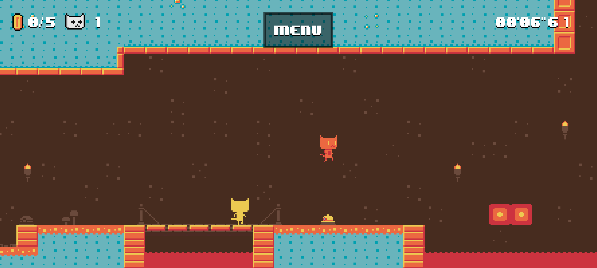

# Sienna for AuroraOS

Port of [Sienna](https://github.com/SimonLarsen/sienna) to [AuroraOS](http://auroraos.ru)




# Build
- download and install [AuroraSDK](https://developer.auroraos.ru/doc/software_development/sdk/downloads)
- list avaliable targets (use sfdk tool from SDK)
    ```
    ~/AuroraOS/bin/sfdk engine exec sb2-config -l
    ```
    its show something like
    ```
    AuroraOS-5.1.3.85-MB2-aarch64.default
    AuroraOS-5.1.3.85-MB2-aarch64
    AuroraOS-5.1.3.85-MB2-armv7hl.default
    AuroraOS-5.1.3.85-MB2-armv7hl
    AuroraOS-5.1.3.85-MB2-x86_64.default
    AuroraOS-5.1.3.85-MB2-x86_64
    ```
    where target names with `.default` suffixes - its snapshots. 
- Choose target "AuroraOS-5.1.3.85-MB2-aarch64" and build an RPM
    ```
    ~/AuroraOS/bin/sfdk -c "target=AuroraOS-5.1.3.85-MB2-aarch64" build-init
    ~/AuroraOS/bin/sfdk -c "target=AuroraOS-5.1.3.85-MB2-aarch64" prepare
    ~/AuroraOS/bin/sfdk -c "target=AuroraOS-5.1.3.85-MB2-aarch64" build
    ```
